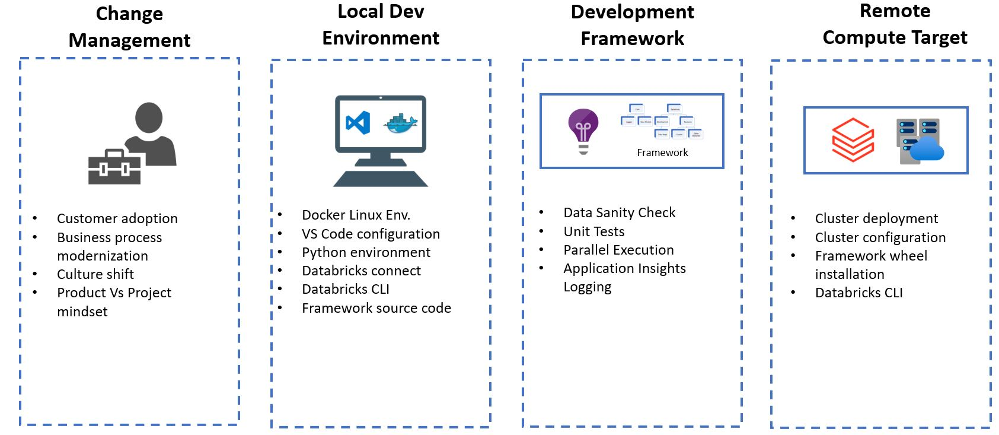
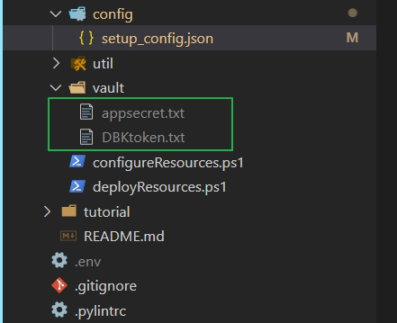
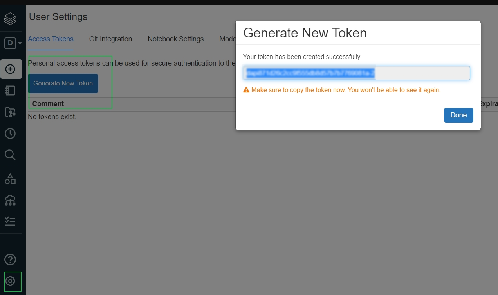

- [About This Repository](#About-This-Repository)
- [Details of The Accelerator](#Details-of-The-Accelerator)
- [Databricks as Infrastructure](#Databricks-as-Infrastructure)
- [Create Databricks Custom Role On DBX SPN](#Create-Databricks-Custom-Role-On-DBX-SPN)


# Heading levels

> This is a fixture to test heading levels

<!-- toc -->

# About This Repository

This Repository contains an Azure Databricks development framework for delivering Data Engineering/Machine Learning projects based on the below Azure Technologies:

| Azure Databricks | Azure Log Analytics | Azure Monitor Service  | Azure Key Vault        |
| ---------------- |:-------------------:| ----------------------:| ----------------------:|

---

Azure Databricks is a powerfull technology, used by Data Engineers and Scientists ubiquitously. However, operationalizing it within a fully automated Continuous Integration and Deployment setup may prove challenging. 

The net effect is a disproportionate amount of the Data Scientist/Engineers time contemplating DevOps matters. This Repositories guiding vision is automate as much of the infrastructure as possible. [^1]

---

# Details of The Accelerator


- Creation of four environments
  - Development 
  - UAT
  - PreProduction
  - Production
- Automated Continuous Deployment 
- Automated package deployment via wheel file creation 
- Logging Framework using the [Opensensus Azure Monitor Exporters](https://github.com/census-instrumentation/opencensus-python/tree/master/contrib/opencensus-ext-azure)
- Support for Databricks Development from VS Code IDE using the [Databricks Connect](https://docs.microsoft.com/en-us/azure/databricks/dev-tools/databricks-connect#visual-studio-code) feature.
- Continuous Development with [Python Local Packaging](https://packaging.python.org/tutorials/packaging-projects/)
- Example Model file which uses the Framework end to end.

# Databricks as Infrastructure

There are many ways that a User may create Jobs, Notebooks, upload files to Databricks DBFS, Create Clusters etc. etc. For example, they may interact   with Databricks API/CLI from:
- Local VSCode
- Within Databricks UI 
- Yaml Pipeline on DevOps Agent (Github Actions/Azure DevOps etc.)
 
One issue that arises is the programmatic way for which this approach adopts. It is strong on flexibility, however, it is somewhat weak on governance and reproducibility. 
 
When intereacting with the Databricks API to execute the functionality listed above, we believe that Jobs, Cluster creation etc. come within the realm of "Infrastructure". We must then find a way to enshrine this Infrastructure _as code_ so that it can consistently be redployed in a Continuous Deployment framework as it cascades across environments. 

As such, all Databricks related infrastrucutre will sit within an environment parameter file, alongside all other infrastructure parameters. The Yaml Pipeline will therefore point to this parameters file, and consistently deploy objects listed therein. 

This does not preclude infrastructre creation on ad hoc basis using the API/within the Portal... we in fact provide the development framework to interact with the Databricks API/CLI using a Docker Image in VSCode. Freedom to choose ! 
 
 # Continuous Deployment + Branching Strategy
 
It is hard to talk about Continuos Deployment credibly without addressing the manner in which that Deployment should look... for example... what branching strategy will be adopted?

The Branching Strategy will build out of the box, and is a Trunk Based Branching Strategy. (Go into more detail)


-   Feature merge to Main: Deploy to Develop Environment 
-   Merge Request from Main To Release: Deploy to UAT
-   Merge Request Approval from Main to Release: Deploy to PreProduction
-   Tag Release Branch with Stable Version: Deploy to Production 
 

# Pre-requisites
<details open>
<summary>Click Dropdown... </summary>
<br>
  
- Github Account
- Access to an Azure Subscription
- Service Principal With Ownership RBAC permissions assigned. (Instructions below)
- Service Principal with Databricks Custom Role Permissions. (Instructions below)
- VS Code installed.
- Docker Desktop Installed (Instructions below)
  
</details>


# Under The Hood
<details close>
<summary>Click Dropdown... </summary>
<br>
  
- Authenticate to Databricks API/CLI using Azure Service Principal Authentication
- Databricks API in Bash
- Databricks CLI in Bash
- Databricks API using Python SDK 
- Yaml Pipelines in Github Actions
- Filter API Responses using JQuery (Bash)
  
</details>


# Create Databricks Custom Role On DBX SPN
<details open>
<summary>Click Dropdown... </summary>
<br>
1. Open IAM at Subscription Level and navigate to creating a Custom Role (as shown below)  

<br>
<br>
<br>

2. Provide Cusom Role Name
<br>

 
</details>

<br>
<br>
<br>
1. Open IAM at Subscription Level and navigate to creating a Custom Role (as shown below)


2. Provide Cusom Role Name


3. Provide Databricks Permissions 


# Create the Service Principals

Create Service Principal (God Rights)

- You will need to Assign RBAC permissions to Azure Resources created on the fly. For example, RBAC permissions to access Key Vault, and store for instance a PAT Token.

- Open the Terminal Window in your VSCode and enter the command below. Be sure to not clear the output. 

``` az ad sp create-for-rbac -n <InsertNameForServicePrincipal> --role Owner --scopes /subscriptions/<InsertYouSubsriptionID> --sdk-auth ```

- You will now see the following output. Copy the JSON object (highlighted with green)


- Create a Secret "AZURE_CREDENTIALS" and paste the JSON Object in


Create Databricks SPN (Contributor Rights + Custom Databricks Role)
- For those who only need permissions to create resources and intereact with the Databricks API.

``` az ad sp create-for-rbac -n <InsertNameForServicePrincipal> --scopes /subscriptions/<InsertYouSubsriptionID> --sdk-auth ```


- Create Github Secrets  ClientID, ClientSecret and TennantID, using the output from the JSON response above.


- Retrieve The ApplicationID using the Command Below, and copy it to a text file. 

``` az ad sp show --id <insert_SP_ClientID> --query appId -o tsv ```

- Retrieve The ObjectID using the Command Below, and copy it to a text file. 

``` az ad sp show --id <insert_SP_ClientID> --query objectId -o tsv ```

- Retrieve The YOUR ObjectID using the Command Below, and copy it to a text file. We will use this to assign you Key Vault Admin permission.

``` az ad user show --id ciaranh@microsoft.com --query objectId ```

Output:

``` "3fb6e2d3-7734-43fc-be9e-af8671acf605" ```

- Now to update the Parameters File With Amendments Below. Do it for each Environment. Note: You can create as many RBAC Assignments as you want. Simply add a new object to the "RBAC_Assignments" Array and the bash script (run later) will pick it up and create it. 


```json

{
    "dbxSPNAppID": "<>",  # Databricks_API_SP ObjectID Saved In Text File
    "SubscriptionId": "<>", # You SubID

    "RBAC_Assignments": [
        {
            "role":"Key Vault Administrator", 
            "roleBeneficiaryObjID":"3fb6e2d3-7734-43fc-be9e-af8671acf605",  # Your ObjectID Saved In Text File
            "Description": "You Object ID",
            "principalType": "User"
        },
        { 
            "role":"Key Vault Administrator",
            "roleBeneficiaryObjID":"0e3c30b0-dd4e-4937-96ca-3fe88bd8f259",  # Databricks_API_SP ObjectID Saved In Text File
            "Description": "Databricks SPN",
            "principalType": "ServicePrincipal"

        },
        {
            "role":"Contributor", 
            "roleBeneficiaryObjID":"0e3c30b0-dd4e-4937-96ca-3fe88bd8f259",  # Databricks_API_SP ObjectID Saved In Text File
            "Description": "Databricks SPN",
            "principalType": "ServicePrincipal"
        },
        {
            "role":"DBX_Custom_Role", # Custom Role Created In Previous Step
            "roleBeneficiaryObjID":"0e3c30b0-dd4e-4937-96ca-3fe88bd8f259", # Databricks_API_SP ObjectID Saved In Text File
            "Description": "Databricks SPN",
            "principalType": "ServicePrincipal"
        }
    ],
    "Git_Configuration": [
        {
            "git_username": "ciaran28", # Update To Your UserName
            "git_provider": "gitHub"
        }
    ],

}

```


# Creating Secrets 

- Secrets in Github should look exactly like this. The secrets are case sensitive, therefore be very cautious when creating. 


## Section 1: Docker image load in VS Code


1. Clone the Repository : https://github.com/microsoft/dstoolkit-ml-ops-for-databricks/pulls
2. Install Docker Desktop. Visual Code uses the docker image as a remote container to run the solution.
3. Create .env file in the root folder, and keep the file blank for now. (root folder is the parent folder of the project)
4. In the repo, open the workspace. File: workspace.ode-workspace.

> Once you click the file, you will get the "Open Workspace" button at right bottom corner in the code editor. Click it to open the solution into the vscode workspace.


5. We need to connect to the [docker image as remote container in vs code](https://code.visualstudio.com/docs/remote/attach-container#_attach-to-a-docker-container). In the code repository, we have ./.devcontainer folder that has required docker image file and docker configuration file. Once we load the repo in the vscode, we generally get the prompt. Select "Reopen in Container". Otherwise we can go to the VS code command palette ( ctrl+shift+P in windows), and select the option "Remote-Containers: Rebuild and Reopen in Containers"


6. In the background, it is going to build a docker image. We need to wait for sometime to complete build. the docker image will basically contain the a linux environment which has python 3.7 installed. Please have a look at the configuration file(.devcontainer\devcontainer.json) for more details. 
7. Once it is loaded. we will be able to see the python interpreter is loaded successfully. Incase it does not show, we need to load the interpreter manually. To do that, click on the select python interpreter => Entire workspace => /usr/local/bin/python


8. You will be prompted with installing the required extension on the right bottom corner. Install the extensions by clicking on the prompts.


9. Once the steps are completed, you should be able to see the python extensions as below:


## Section 2: Databricks Environment Creation

- Create Service Principals
- 


#OLD SECTION


The objectives of this section are:

- Create the required resources.
    1. Azure Databricks
    2. Application Insight Instance.
    3. A log analytics workspace for the App Insight.
    4. Azure Key Vault to store the secrets.
    5. A Storage Account.

- Create the .env file for the local development.

> You don't need to create the environment again if you already had a databricks environment. You can directly create the .env file ( Section 4 ) with the details of your environment.

1. Go to **src/setup/config/setup_config.json**, and complete the json files with the values; according to your environment. The service principal should be having the contributor access over the subscription you are using. Or if you choose to create the resource group manually, or reuse an existing resource group, then it should have the contributor access on the resource group itself.

> These details would be used to connect to the Azure Subscription for the resource creation.

``` json
{
 
    "applicationID":"deeadfb5-27xxxaad3-9fd39049b450",
    "tenantID":"72f988bf-8xxxxx2d7cd011db47",
    "subscriptionID":"89c37dd8xxxx-1cfb98c0262e",
    "resourceGroupName":"AccleratorDBKMLOps2",
    "resourceGroupLocation":"NorthEurope"
}
```

2. create the file and provide the client ID secret in this file : **src/setup/vault/appsecret.txt**

> Incase you are not able to create the file from the solution, you can directly go to the file explorer to create the file.
>
> NOTE: DBToken.txt will be created in the later section, please ignore it for now.

At the end of the secret files creation, the folder structure will like below:



3. Open the Powershell ISE in your local machine. We are going to run the Powershell script to create the required resources. The name of the resources are basically having a prefix to the resourcegroup name.
4. set the root path of the Powershell terminal till setup, and execute the deployResource.ps1

``` powershell
cd "C:\Users\projects\New folder\MLOpsBasic-Databricks\src\setup"
.\deployResources.ps1
```

> If you receive the below error, execute the  command [Set-ExecutionPolicy RemoteSigned]

``` cmd
>.\deployResources.ps1 : File C:\Users\projects\New
folder\MLOpsBasic-Databricks\src\setup\deployResources.ps1 cannot be loaded because running scripts is disabled on this.
```
> if you get the error module is not found, and if Powershell ISE is not able to recognize any specific Powershell command, then Install the Powershell Az Module. [Instructions](https://docs.microsoft.com/en-us/powershell/azure/install-az-ps?view=azps-6.4.0)
``` cmd
Install-Module  Az
```


Post successful execution of the script, we can see the resources created successfully in the Azure Subscription.


## Section 3: Databricks cluster creation


1. To create the databricks cluster we need to have personal Access token created. Go to the Databricks workspace, and get the personal access token from the user setting, and save it in the file src/setup/vault/DBKtoken.txt



2. Run the following command

``` cmd
cd "C:\Users\projects\New folder\MLOpsBasic-Databricks\src\setup"
 
.\configureResources.ps1
```

3. At the end of the script execution, we will be able to see the databricks cluster has been created successfully.the config file: src\setup\util\DBCluster-Configuration.json is being used to create the cluster.


4. Copy the output of the script and paste it to the .env file which we had created previously. Please note that the values of the variables will be different as per your environment configuration. the later section (Section 4) describes the creation of .env file in detail.


## Section 4: Create the .env file


We need to manually change the databricks host and appI_IK values. Other values should be "as is" from the output of the previous script.

- PYTHONPATH: /workspaces/dstoolkit-ml-ops-for-databricks/src/modules [This is  full path to the module folder in the repository.]
- APPI_IK: connection string of the application insight
- DATABRICKS_HOST: The URL of the databricks workspace.
- DATABRICKS_TOKEN: Databricks Personal Access Token which was generated in the previous step.
- DATABRICKS_ORDGID: OrgID of the databricks that can be fetched from the databricks URL.


Application Insight Connection String


At the end, our .env file is going to look as below. You can copy the content and change the values according to your environment.

``` conf
PYTHONPATH=/workspaces/dstoolkit-ml-ops-for-databricks/src/modules
APPI_IK=InstrumentationKey=e6221ea6xxxxxxf-8a0985a1502f;IngestionEndpoint=https://northeurope-2.in.applicationinsights.azure.com/
DATABRICKS_HOST=https://adb-7936878321001673.13.azuredatabricks.net
DATABRICKS_TOKEN= <Provide the secret>
DATABRICKS_ORDGID=7936878321001673
```

## Section 5: Configure the Databricks connect


1. In this step we are going to configure the databricks connect for VS code to connect to databricks. Run the below command for that from the docker (VS Code) terminal.

``` bash
$ python "src/tutorial/scripts/local_config.py" -c "src/tutorial/cluster_config.json"
```

>Note: If you get any error saying that "ModelNotFound : No module names dbkcore". Try to reload the VS code window and see if you are getting prompt  right bottom corner saying that configuration file changes, rebuild the docker image. Rebuild it and then reload the window. Post that you would not be getting any error. Also, check if the python interpreter is being selected properly. They python interpreter path should be **/usr/local/bin/python **


### Verify

1. You will be able to see the message All tests passed.


## Section 6: Wheel creation and workspace upload


In this section, we will create the private python package and upload it to the databricks environment.

1. Run the below command:

``` bash
python src/tutorial/scripts/install_dbkframework.py -c "src/tutorial/cluster_config.json"
```

Post Execution of the script, we will be able to see the module to be installed.


## Section 7: Using the framework


We have a  pipeline that performs the data preparation, unit testing, logging, training of the model.


### Execution from Local VS Code

To check if the framework is working fine or not, let's execute this file : **src/tutorial/scripts/framework_testing/remote_analysis.py** . It is better to execute is using the interactive window. As the Interactive window can show the pandas dataframe which is the output of the script. Otherwise the script can be executed from the Terminal as well.
To run the script from the interactive window, select the whole script => right click => run the selection in the interactive window.

Post running the script, we will be able to see the data in the terminal.


[^1]: Test
